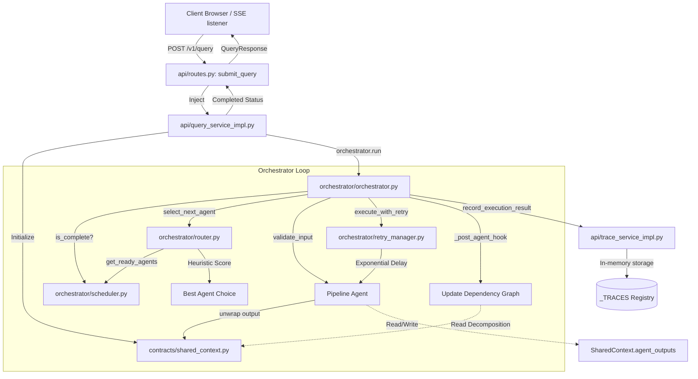

# Mega-AI: Production-Grade Multi-Agent Orchestration & Observability System
## Comprehensive Technical Reference & Architecture Guide

Welcome to the **Mega-AI Technical Reference Guide**. This document serves as the authoritative source of truth for the system's architecture, design patterns, core mathematical/heuristic rules, and class/function-level APIs. 

---

## 1. System Overview & SOLID Alignment

Mega-AI is a production-grade multi-agent execution runtime engineered with strict adherence to software engineering best practices, type safety, and decoupled design. The system accepts a top-level query, decomposes it dynamically into a dependency-ordered Directed Acyclic Graph (DAG) of typed subtasks, routes execution through a loop of specialized agents, manages retry-backoff safety, enforces token budgets, and exposes an asynchronous, event-driven API.

### Design Invariants (SOLID Compliance)
- **Single Responsibility Principle (SRP):** Every module has one actor/responsibility. The API routes merely delegate; the `MultiAgentOrchestrator` schedules and runs; the `DependencyScheduler` handles only topological correctness and deadlock prevention; each Agent handles one isolated task type.
- **Open/Closed Principle (OCP):** The system relies heavily on polymorphism and hook methods. You can introduce new agents, rewrite scoring rules, or swap LLM backends by overriding base class templates (e.g., `_score_candidate`, `_merge_strategy`, `_summarize_prose`) without changing core orchestration logic.
- **Liskov Substitution Principle (LSP):** All domain agents inherit from `BaseAgent[SharedContext, TResult]`. Any subclass is substitutable anywhere the generic agent type is expected, without breaking execution invariants.
- **Interface Segregation Principle (ISP):** Strategy contracts are kept extremely narrow. `IRouter`, `IScheduler`, and `IRetryManager` are declared as tiny abstract interfaces in `orchestrator.interfaces`, decoupling implementations.
- **Dependency Inversion Principle (DIP):** The orchestrator depends exclusively on abstract interfaces. All concrete strategies and peer agents are injected via constructor Dependency Injection (DI).

---

## 2. Architectural Blueprint & Request Life Cycle

The following diagram illustrates the end-to-end data flow when a user submits a query to Mega-AI.




### Detailed Life Cycle Phases
1. **Bootstrap Phase:** The FastAPI layer initializes the `MultiAgentOrchestrator` with four default agents: `DecompositionAgent`, `RetrievalAgent`, `CritiqueAgent`, and `SynthesisAgent`.
2. **Submission Phase:** A query is received. An execution UUID is minted, and a new `SharedContext` is instantiated with the query, session ID, and target budgets.
3. **Decomposition Phase:** The `DecompositionAgent` runs first. It parses the query, maps it into candidate subtasks, assigns categories (`retrieval`, `reasoning`, `synthesis`), and generates topological edges.
4. **Graph Update Phase:** The orchestrator captures the `DecompositionResult` in its `_post_agent_hook` and dynamically constructs the dependency graph on the `SharedContext`.
5. **Scheduling & Routing Phase:** The `DependencyScheduler` calculates which agents are unblocked. The `DynamicRouter` scores ready agents and selects the highest priority agent.
6. **Execution & Retry Phase:** The `ExponentialRetryManager` runs the selected agent, capturing telemetry and token counts. It applies exponential backoff on transient failures.
7. **Trace Recording Phase:** Upon completion or failure, the runtime registers the full history in the in-memory global registry `_TRACES` for REST observability.

---

## 3. Core Engine Heuristics & Mathematical Specifications

### 3.1. Kahn's Topological Sorting
Topological sorting is performed in both the `DecompositionAgent` and the `DependencyScheduler` to determine correct execution order and prevent deadlocks.
- Given a set of vertices $V$ (subtasks) and directed edges $E$ (dependencies):
- An in-degree table is computed for all nodes:
  $$in\_degree(v) = |\{u \in V \mid (u, v) \in E\}|$$
- Nodes with an in-degree of 0 are queued.
- When a node is popped, it is added to the sorted order, and the in-degree of all its successors is decremented. Successors hitting 0 in-degree are added to the queue.
- If the sorted list size is less than $|V|$ at the end of the algorithm, a **cycle is detected**, raising a `ValueError`.

### 3.2. Dynamic Router Heuristic Scoring
The `DynamicRouter` scores ready candidates to pick the optimal next step using the following additive heuristic:
$$\text{Score}(A) = \text{Baseline} + S_{\text{reliability}}(A) + S_{\text{urgency}}(A) + S_{\text{decomposition}}(A)$$

Where:
- **Baseline = 0.0**
- **Reliability Boost ($S_{\text{reliability}}$):** $+0.50$ if the agent has no previous failure record in this run. If its status is currently `FAILED`, it receives a penalty of $-0.40$.
- **Urgency Boost ($S_{\text{urgency}}$):** $+0.30$ if the agent is a leaf node in the active dependency graph (i.e., no other pending agents are waiting for this agent to finish). This ensures high-impact nodes run first.
- **Decomposition Override ($S_{\text{decomposition}}$):** $+0.40$ if the candidate is the `DecompositionAgent` and its status is `PENDING`. This guarantees graph definition executes immediately.

### 3.3. Ambiguity Check Threshold
To ensure deterministic execution paths, the router checks the gap between the top-scoring agent $A_1$ and the runner-up $A_2$:
$$\text{Gap} = \text{Score}(A_1) - \text{Score}(A_2)$$
If $\text{Gap} \le 0.05$ (5%), the decision is flagged as **ambiguous**, emitting an `EventType.ROUTING_AMBIGUOUS` warning event.

### 3.4. Token-Frequency Cosine Similarity
The `RetrievalAgent` utilizes a zero-dependency tf-idf style metric to compute relevance between query $Q$ and document content $D$:
- Tokenization converts text to lowercase alphabetic sequences: $\text{Tokens} = \{t \in \text{lowercase\_words}\}$.
- Term frequency for term $t$ in list $T$:
  $$\text{tf}(t, T) = \frac{\text{count}(t, T)}{|T|}$$
- The overlap $S = Q_{\text{tokens}} \cap D_{\text{tokens}}$ is calculated.
- Cosine similarity:
  $$\text{Similarity}(Q, D) = \frac{\sum_{t \in S} \text{tf}(t, Q) \times \text{tf}(t, D)}{\sqrt{\sum_{q \in Q} \text{tf}(q, Q)^2} \times \sqrt{\sum_{d \in D} \text{tf}(d, D)^2}}$$

### 3.5. Claim Confidence Heuristic
The `CritiqueAgent` scores extracted claim sentences $S$ based on linguistic composition:
$$\text{Confidence}(S) = 0.5 - (0.08 \times N_{\text{hedges}}) + (0.05 \times N_{\text{asserts}})$$
- **Hedges:** words showing uncertainty (`might`, `may`, `could`, `possibly`, `perhaps`, `unclear`, `suggest`).
- **Asserts:** assertive verbs (`is`, `are`, `was`, `shows`, `demonstrates`, `confirms`, `proves`).
- **Classifications:**
  - $\text{Confidence} \ge 0.70 \rightarrow \text{HIGH}$
  - $0.45 \le \text{Confidence} < 0.70 \rightarrow \text{MEDIUM}$
  - $0.20 \le \text{Confidence} < 0.45 \rightarrow \text{LOW}$
  - $\text{Confidence} < 0.20 \rightarrow \text{UNKNOWN}$

### 3.6. Context Compression Prose Summarization
The `CompressionAgent` scores prose sentences to retain the top $N$ sentences (where $N = \text{target\_ratio} \times \text{total\_sentences}$):
$$\text{SentenceScore}(S_i) = \text{Density}(S_i) + \text{PositionBonus}(S_i)$$
Where:
- $\text{Density}(S_i) = \frac{\sum_{t \in S_i} \text{frequency\_in\_entire\_document}(t)}{|S_i|}$
- $\text{PositionBonus}(S_i) = \frac{1.0}{i + 1}$ (preferring earlier sentences).

---

## 4. Architectural Domain Contracts & Data Models

### 4.1. `SharedContext` (`contracts/shared_context.py`)
The unified central mutable state object. Thread-safe via an internal re-entrant lock (`RLock`).

| Field Name | Type | Purpose |
| :--- | :--- | :--- |
| `query` / `goal` | `str` | The user's query; automatically synchronized on validation. |
| `run_id` / `task_id`| `str` | Unique tracking UUID; automatically synchronized. |
| `conversation_history`| `List[Message]` | Structured log of user and agent messages. |
| `documents` | `List[Document]` | Loaded texts scanned during the multi-hop retrieval. |
| `agent_outputs` | `Dict[str, Any]` | Map of concrete agent outcomes (e.g. `RetrievalResult`). |
| `available_agents` | `List[str]` | List of registered agent names. |
| `agent_statuses` | `Dict[str, str]` | In-flight execution status tracker (`PENDING`, `RUNNING`, `COMPLETED`). |
| `dependency_graph` | `Dict[str, List[str]]`| Adjacency list: child agent $\rightarrow$ dependencies list. |
| `token_budget` | `int` | Maximum allowed tokens before budget halts execution. |
| `tokens_used` | `int` | Aggregated count of tokens consumed. |

### 4.2. Tool Execution Envelope (`contracts/tool_contracts.py`)
All tools consume a standard request and return a standard response envelope.

```python
class ToolRequest(BaseModel):
    tool_name: str
    payload: dict[str, Any]
    request_id: str = Field(default_factory=lambda: str(uuid.uuid4()))
    timeout: float | None = None
    metadata: dict[str, Any] = Field(default_factory=dict)

class ToolResponse(BaseModel):
    request_id: str
    tool_name: str
    status: ToolStatus  # SUCCESS | ERROR | TIMEOUT | INVALID_INPUT
    data: Any | None = None
    error: str | None = None
    attempts: int = 1
    duration_ms: float = 0.0
```

---

## 5. Directory & File Walkthrough

### 5.1. `interfaces/`
Declares abstract base classes defining system-wide architectural boundaries.
- **`base_agent.py`:** Defines `BaseAgent[TInput, TOutput]` which wraps execution in a template method (`__call__`) enforcing pre-flight validation, post-flight validation, and timeout monitoring.
- **`base_tool.py`:** Defines `BaseTool`. Governs the tool execution loop, managing input validation, central error translation, and a retry loop with exponential delay.

### 5.2. `contracts/`
Defines strictly-typed data transfer schemas, eliminating tight couplings.
- **`shared_context.py`:** Contains `SharedContext`, `Message`, `Document`, `AgentOutput`, and `TokenUsage`.
- **`models.py`:** Defines events emitted during orchestration (`ExecutionEvent`, `AgentExecutionEvent`, `EventType`, `ExecutionStatus`, `PolicyViolation`).
- **`agent_contracts.py`:** Declares strong Pydantic return schemas for all pipeline agents (`DecompositionResult`, `RetrievalResult`, `CritiqueResult`, `SynthesisResult`, `CompressionResult`).
- **`tool_contracts.py`:** Contains input/output wrappers for standard tool interactions.

### 5.3. `orchestrator/`
The coordination engine executing agent interactions.
- **`orchestrator.py`:** Orchestrates the runtime loop. Monitors token exhaustion, manages pre-flight and post-agent hooks, updates the dependency graph on `DecompositionResult` capture, and emits execution events.
- **`scheduler.py`:** Handles DAG validation. Checks for cycles using a three-color coloring algorithm, tracks agent status changes, and lists all agents eligible for immediate execution.
- **`router.py`:** Decides the next agent. Evaluates goals and readiness lists, uses additive scoring rules, and warns if multiple ready agents are tied within the ambiguity margin.
- **`retry_manager.py`:** Implements `ExponentialRetryManager`. Executes agents inside standard asyncio tasks, catching transient exceptions and applying retries with backoff and jitter.

### 5.4. `agents/`
Specialized agents running within the pipeline:
- **`decomposition_agent.py`:** Breaks complex user requests into smaller, categorized subtasks, and defines dependency relationships between them.
- **`retrieval_agent.py`:** Executes multi-hop queries over supporting documents. Ingests local files from `data/`, and traces chunk ancestry back to the original source.
- **`critique_agent.py`:** Extracts claims, rates sentence confidence using grammatical analysis, finds negations indicating contradictions, and rates overall document quality.
- **`synthesis_agent.py`:** Integrates multi-agent outcomes. Resolves conflicting statements using confidence-based rules, and generates a structured, cited answer using LLMs (Azure AI / OpenAI) or simple fallback rules.
- **`compression_agent.py`:** Compacts large contexts. Scans text with regular expressions to protect code blocks, markdown tables, JSON, and math formulas, strips conversational filler, and condenses prose.

### 5.5. `tools/`
External tools agents can call during run:
- **`sandbox_tool.py`:** Runs Python code inside a separate child process. Enforces runtime limits, intercepts standard output and error streams, and limits memory on POSIX.
- **`web_search_tool.py`:** Simulates search index queries, returning titles, snippets, and relevance scores.
- **`sql_lookup_tool.py`:** Converts natural language questions into database queries, runs them against SQLite, and formats results.
- **`self_reflection_tool.py`:** Reflects on output, finding claims that contradict the source documents or are missing proper citations.

### 5.6. `api/`
Exposes the multi-agent system via REST.
- **`app.py`:** Bootstraps FastAPI, configures CORS, registers global error handlers, and sets up middleware.
- **`routes.py`:** Exposes standard endpoints (`/query`, `/runs/{id}/trace`, `/runs/{id}/eval`, `/runs/{id}/rewrite`, `/runs/{id}/reeval`). Plugs in services using dependency injection.
- **`query_service_impl.py`:** Orchestrates query submission. Bridges the HTTP layer and the core `MultiAgentOrchestrator`, supporting synchronous execution and server-sent events (SSE).
- **`trace_service_impl.py`:** Maintains trace histories, converting active events into standard timeline steps.

---

## 6. Comprehensive Class & Function Level API Reference

### 6.1. Interface Layer (`interfaces/`)

#### Class: `BaseAgent(ABC, Generic[TInput, TOutput])`
Abstract base class for all agent execution blocks.
*   **Method: `run(context: TInput) -> TOutput` (Abstract)**
    *   *Input:* `context` (SharedContext)
    *   *Output:* Typed agent result (e.g. `DecompositionResult`).
    *   *Purpose:* Concrete logic implementation.
*   **Method: `validate_input(context: TInput) -> None`**
    *   *Purpose:* Validates input. Raises `AgentValidationError` if invalid.
*   **Method: `validate_output(result: TOutput) -> None`**
    *   *Purpose:* Validates output. Raises `AgentValidationError` if invalid.
*   **Method: `__call__(context: TInput) -> TOutput` (Final)**
    *   *Purpose:* Executes validation $\rightarrow$ run (with timeout monitor) $\rightarrow$ validation.

#### Class: `BaseTool(ABC)`
Abstract base class for all external tools.
*   **Method: `run(request: ToolRequest, context: SharedContext) -> ToolResponse` (Final)**
    *   *Purpose:* Tool execution wrapper. Manages retries, exponential backoff, and maps exceptions to failure envelopes.
*   **Method: `execute(request: ToolRequest, context: SharedContext) -> ToolResponse` (Abstract)**
    *   *Purpose:* Core tool execution logic.
*   **Method: `validate(request: ToolRequest) -> None` (Abstract)**
    *   *Purpose:* Validates request payload structure.

---

### 6.2. Orchestration Layer (`orchestrator/`)

#### Class: `MultiAgentOrchestrator(IOrchestrator)`
Central multi-agent loop controller.
*   **Method: `run(context: SharedContext) -> tuple[SharedContext, ExecutionEvent]`**
    *   *Purpose:* Runs the multi-agent loop. Iteratively routes execution, checks readiness, monitors budgets, and collects events.
*   **Method: `_post_agent_hook(response: ToolResponse, context: SharedContext, event_sink: List[AgentExecutionEvent]) -> None`**
    *   *Purpose:* Captures `DecompositionResult` outputs and maps subtask lists to the orchestrator's `dependency_graph`.

#### Class: `DependencyScheduler(IScheduler)`
Graph scheduler and cycle detector.
*   **Method: `get_ready_agents(context: SharedContext) -> List[str]`**
    *   *Purpose:* Identifies pending agents whose dependencies are fully completed.
*   **Method: `is_complete(context: SharedContext) -> bool`**
    *   *Purpose:* Returns `True` if all nodes in the graph are finished.
*   **Method: `_detect_cycles(graph: Dict[str, List[str]]) -> None`**
    *   *Purpose:* Runs cycle detection. Walks the graph using DFS with a three-color tracking scheme (`WHITE`, `GREY`, `BLACK`).

#### Class: `DynamicRouter(IRouter)`
Dynamically selects the next agent.
*   **Method: `select_next_agent(context: SharedContext) -> Optional[str]`**
    *   *Purpose:* Scores candidates, filters blocked paths, checks for ambiguity ties, and returns the chosen agent name.
*   **Method: `_score_candidate(agent_name: str, context: SharedContext) -> float`**
    *   *Purpose:* Computes reliability boosts, urgency bonuses, and goal keywords to rate agent priority.

#### Class: `ExponentialRetryManager(IRetryManager)`
Executes code with transient error recovery.
*   **Method: `execute_with_retry(agent: BaseAgent, context: SharedContext, event_sink: List[AgentExecutionEvent]) -> ToolResponse`**
    *   *Purpose:* Runs agents inside standard asyncio tasks. Monitors timeouts, catches exceptions, and retries with backoff and randomized jitter.

---

### 6.3. Agent Layer (`agents/`)

#### Class: `DecompositionAgent(BaseAgent)`
Decomposes queries into structured task sequences.
*   **Method: `_decompose_query(query: str, context: SharedContext) -> List[str]`**
    *   *Purpose:* Splits queries on conjunctions (`and`, `then`) or punctuation to generate candidate subtask lists.
*   **Method: `_build_edges(subtasks: List[SubTask]) -> List[DependencyEdge]`**
    *   *Purpose:* Builds dependency relationships (e.g. retrieval subtasks must always run before reasoning or synthesis steps).

#### Class: `RetrievalAgent(BaseAgent)`
Gathers documents and builds provenance chains.
*   **Method: `_ingest_local_data(context: SharedContext) -> None`**
    *   *Purpose:* Ingests text documents from the local `./data/` folder, skipping duplicates.
*   **Method: `_score_chunk(query: str, doc: Document) -> float`**
    *   *Purpose:* Measures document relevance using TF-IDF token cosine similarity.
*   **Method: `_build_provenance(chunk: RetrievedChunk, all_chunks: List[RetrievedChunk], hop: int) -> ProvenanceMap`**
    *   *Purpose:* Generates parent chunk tracking paths, documenting execution history.

#### Class: `CritiqueAgent(BaseAgent)`
Evaluates content quality.
*   **Method: `_collect_sentences(context: SharedContext, max_claims: int) -> List[str]`**
    *   *Purpose:* Extracts candidate sentences from retrieved documents or context queries.
*   **Method: `_score_claim(sentence: str) -> Tuple[float, ConfidenceLevel, str]`**
    *   *Purpose:* Rates claim confidence based on hedges and assertive verbs.
*   **Method: `_detect_contradictions(claim_scores: List[ClaimScore]) -> List[Contradiction]`**
    *   *Purpose:* Finds contradictions where overlapping nouns appear alongside negation words.

#### Class: `SynthesisAgent(BaseAgent)`
Synthesizes context findings into unified answers.
*   **Method: `_resolve_contradictions(critique: Optional[CritiqueResult], strategy: str) -> List[ResolvedContradiction]`**
    *   *Purpose:* Applies resolution strategies (e.g. keep highest confidence claims) to resolve contradictions.
*   **Method: `_merge_strategy(query: str, passages: List[str], resolved: List[ResolvedContradiction], critique: Optional[CritiqueResult]) -> str`**
    *   *Purpose:* Merges sources. If `OPENAI_API_KEY` is present, queries LLMs (OpenAI or Azure AI models) with structured system prompts. Otherwise, falls back to heuristic generation.

#### Class: `CompressionAgent(BaseAgent)`
Condenses large context payloads.
*   **Method: `_extract_structured_blocks(text: str) -> Tuple[str, List[StructuredBlock]]`**
    *   *Purpose:* Replaces complex markdown blocks (tables, code, formulas) with placeholder tags (`[BLOCK:id]`) to protect them from compression.
*   **Method: `_strip_filler(text: str, aggressiveness: float) -> str`**
    *   *Purpose:* Strips conversational filler and polite transitions from the text.
*   **Method: `_summarize_prose(text: str, target_ratio: float) -> str`**
    *   *Purpose:* Filters and retains sentences with high token density and early document positions.

---

### 6.4. Tools Layer (`tools/`)

#### Class: `SandboxTool(BaseTool)`
Runs Python code inside a separate subprocess.
*   **Method: `execute(request: ToolRequest, context: SharedContext) -> ToolResponse`**
    *   *Purpose:* Writes code to a temporary file, starts `sys.executable` in a subprocess, monitors execution limits, and isolates POSIX process memory.

#### Class: `WebSearchTool(BaseTool)`
Simulates search index lookups.
*   **Method: `execute(request: ToolRequest, context: SharedContext) -> ToolResponse`**
    *   *Purpose:* Scans mock databases using TF-IDF checks, returning titles, snippets, and similarity rankings.

#### Class: `SQLLookupTool(BaseTool)`
Runs database lookups.
*   **Method: `execute(request: ToolRequest, context: SharedContext) -> ToolResponse`**
    *   *Purpose:* Connects to SQLite databases, runs generated SQL queries, and returns raw data lists alongside column names.

#### Class: `SelfReflectionTool(BaseTool)`
Validates final answers.
*   **Method: `execute(request: ToolRequest, context: SharedContext) -> ToolResponse`**
    *   *Purpose:* Audits generated texts, checking that all statements are properly grounded in source documents and accompanied by valid citations.

---

### 6.5. REST API Layer (`api/`)

#### Function: `create_app(*, query_service_factory, trace_service_factory, eval_service_factory, rewrite_service_factory) -> FastAPI`
Application factory. Configures global CORS rules, registers error handlers, and wires in concrete services.

#### Class: `QueryService(IQueryService)`
Bridges the HTTP layer and the core orchestrator.
*   **Method: `submit(request: QueryRequest) -> QueryResponse`**
    *   *Purpose:* Builds runtime contexts, runs the orchestrator, extracts synthesis findings, and records trace histories.
*   **Method: `stream(request: QueryRequest, run_id: Optional[str]) -> AsyncIterator[SSEEvent]`**
    *   *Purpose:* Starts execution inside an asyncio task, checks queues for agent events, and streams Server-Sent Events (SSE).

#### Class: `TraceService(ITraceService)`
Manages trace registry storage.
*   **Method: `get_trace(run_id: str) -> ExecutionTraceResponse`**
    *   *Purpose:* Retrieves recorded trace logs. Raises `RunNotFoundError` if the run ID does not exist.

---

## 7. Operational Validation & Testing

### 7.1. Running Standalone Debug Verification
Each major module contains a self-contained `if __name__ == "__main__":` block that serves as a direct debug harness. You can run individual components directly in Python to verify their internal behaviors:
```powershell
# Verify the Orchestrator loop using stub agents
python orchestrator/orchestrator.py

# Verify Decomposition Agent's parsing logic
python agents/decomposition_agent.py

# Verify multi-hop retrieval scoring
python agents/retrieval_agent.py

# Verify Critique claim extraction and contradictions
python agents/critique_agent.py

# Verify LLM/heuristic Synthesis merging
python agents/synthesis_agent.py

# Verify structured block preservation and filler stripping
python agents/compression_agent.py
```

### 7.2. Production Deployment Validation
To verify API-level compliance, you can start the application using Docker Compose and run the mock execution scripts:
```powershell
# Build and run the entire suite in isolation
docker-compose up --build -d

# Verify API SSE streaming response
python scratch_test_api_stream.py
```
This will confirm the health of the FastAPI routing layer, dependency injection mechanisms, and event emission routines.
