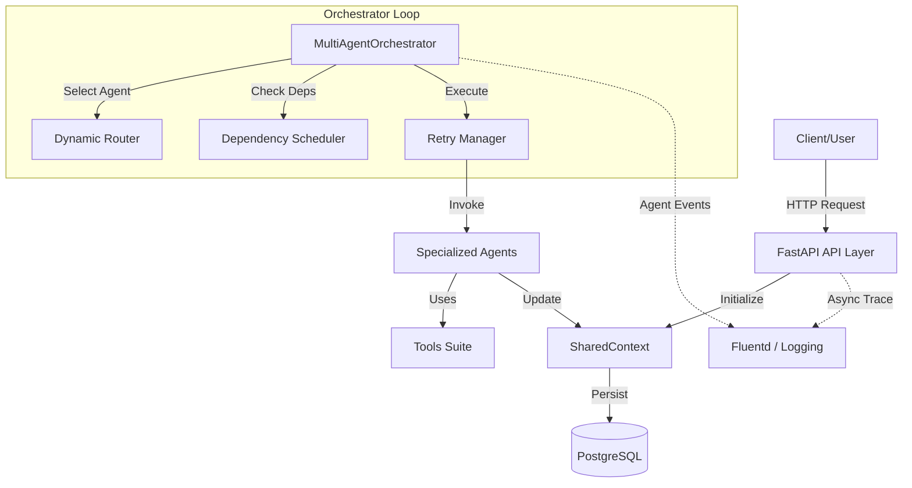
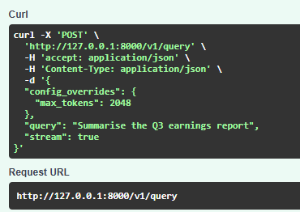
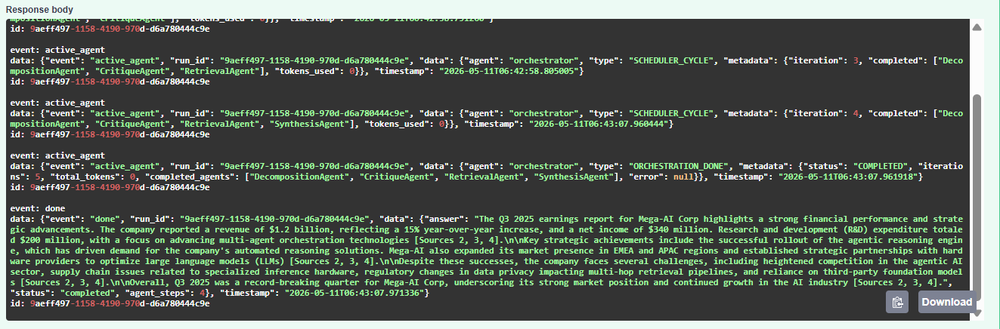
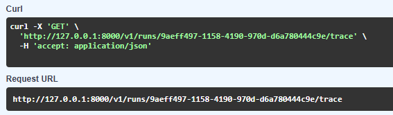
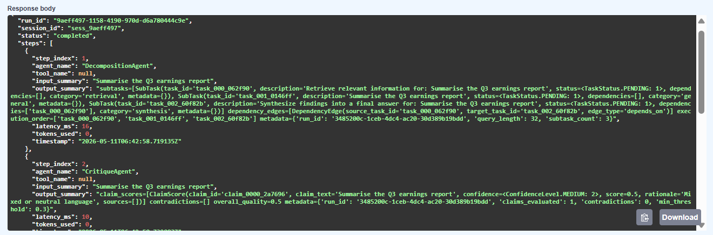

# Mega-AI Multi-Agent System

Mega-AI is a powerful, production-grade multi-agent orchestration framework designed for complex reasoning, retrieval-augmented generation (RAG), and self-correcting pipelines. It utilizes a graph-based orchestration model to coordinate specialized agents in a highly resilient environment.

## 🏗 Architecture
The system follows a microservices-inspired internal architecture:



- **API Layer**: FastAPI-based server providing asynchronous and streaming (SSE) endpoints.
- **Orchestration Layer**: A central `MultiAgentOrchestrator` that manages the execution flow using a dynamic router and a dependency-aware scheduler.
- **Agent Layer**: specialized agents that implement a unified `BaseAgent` interface.
- **Infrastructure**: Dockerized environment with PostgreSQL for state management and Fluentd for centralized logging.

## 🚀 Setup & Docker Instructions
Ensure you have Docker and Docker Compose installed.

1.  **Environment Configuration**:
    Create a `.env` file in the root directory (refer to `.env.example` if available).
    ```env
    POSTGRES_DB=mega_ai
    POSTGRES_USER=admin
    POSTGRES_PASSWORD=secret
    API_SECRET_KEY=your_secret_key
    ```

2.  **Launch the System**:
    ```powershell
    docker compose up -d --build
    ```

3.  **Verify Services**:
    - API: `http://localhost:8000/health`
    - Logs: accessible via Fluentd or `docker compose logs -f`

## 🧠 LLM Provider Support
The system dynamically supports multiple LLM providers based on your `OPENAI_API_KEY` prefix:

| Provider | Key Type | Auto-Detected Endpoint |
| :--- | :--- | :--- |
| **OpenAI** | `sk-...` | Standard OpenAI API |
| **GitHub Models** | `github_pat_...` | GitHub AI Inference (`models.inference.ai.azure.com`) |

### Configuration (`.env`)
- **`OPENAI_API_KEY`**: Your secret key or GitHub Personal Access Token.
- **`LLM_MODEL`**: The model name to use (e.g., `gpt-4o`, `gpt-5`, `meta-llama-3.1-405b-instruct`). Default is `gpt-4o`.

## 📸 Visual Overview

### 🔍 Query Interface
Explore the seamless multi-agent orchestration in action.
| Main Chat View | Multi-Agent Thought Process |
| :--- | :--- |
|  |  |

### 🛤️ Trace Audit Trail
Deep-dive into the performance and data flow of every run.
| Execution Timeline | Agent Node Graph |
| :--- | :--- |
|  |  |

## 📡 Endpoints
The system exposes the following RESTful endpoints:

| Method | Endpoint | Description |
| :--- | :--- | :--- |
| `GET` | `/health` | Service health status and heartbeat. |
| `POST` | `/query` | Submit a query. Supports `stream=true` for Server-Sent Events (SSE). |
| `GET` | `/runs/{id}/trace` | Retrieve the full execution trace and agent event logs. |
| `GET` | `/runs/{id}/eval` | Get the latest evaluation summary for a specific run. |
| `POST` | `/runs/{id}/rewrite` | Approve or reject a proposed content rewrite. |
| `POST` | `/runs/{id}/reeval` | Trigger a targeted re-evaluation of specific metrics. |

## 🤖 Agents
Specialized agents collaborate to fulfill complex requests:
- **DecompositionAgent**: Breaks down high-level goals into sub-tasks and dependency edges.
- **RetrievalAgent**: Performs multi-hop document retrieval.
- **CritiqueAgent**: Evaluates claims for factual consistency and quality.
- **SynthesisAgent**: Merges agent outputs into a final, coherent response.
- **CompressionAgent**: Optimizes context windows by summarizing filler text.

## 🛠 Tools
Agents have access to a suite of internal tools:
- **Web Search**: Real-time information retrieval from the web.
- **SQL Lookup**: Natural language to SQL conversion and database execution.
- **Self Reflection**: Meta-analysis of previous agent outputs.
- **Sandbox**: Secure execution of Python code for calculations or data processing.

## 🔄 Orchestration Flow
1.  **Bootstrap**: The Orchestrator initializes the `SharedContext` with the user query.
2.  **Routing**: The `DynamicRouter` selects the next candidate agent based on the current state.
3.  **Scheduling**: The `DependencyScheduler` ensures agents only run when their dependencies are met.
4.  **Execution**: The `RetryManager` executes agents with exponential back-off and timeout protection.
5.  **Completion**: Results are accumulated, validated against policies, and returned to the user.

## ⚠️ Limitations
- **Synchronous Execution Loop**: While the orchestration loop is async, individual agent `run` methods are currently synchronous and executed in a thread pool.
- **Memory Consistency**: `SharedContext` uses a mix of Pydantic models and internal dictionary state; deep nested updates require careful synchronization.
- **Stateless Workers**: The current worker implementation is a debug harness that exits after one run. A persistent task queue consumer is required for high-concurrency production use.

## AI Usage / Attestation
AI-assisted development tools were used during architecture generation, debugging, and integration.

Tools used:
- Claude (Anthropic) — modular architecture scaffolding, contracts, agent/tool generation
- ChatGPT — systems integration guidance, debugging workflows, orchestration stabilization
- Google Antigravity IDE — debugging assistance and runtime issue analysis

All generated code was manually reviewed, integrated, debugged, and adapted for compatibility. Significant engineering effort was spent on:
- dependency consolidation
- contract unification
- Docker integration
- runtime debugging
- API wiring
- orchestration validation
- deployment reproducibility

## Future Improvements

- Real vector database integration
- Persistent execution trace storage
- LLM-backed routing policies
- Tool sandbox hardening
- Kubernetes deployment
- Real retrieval corpora
- Human-in-the-loop approval flows